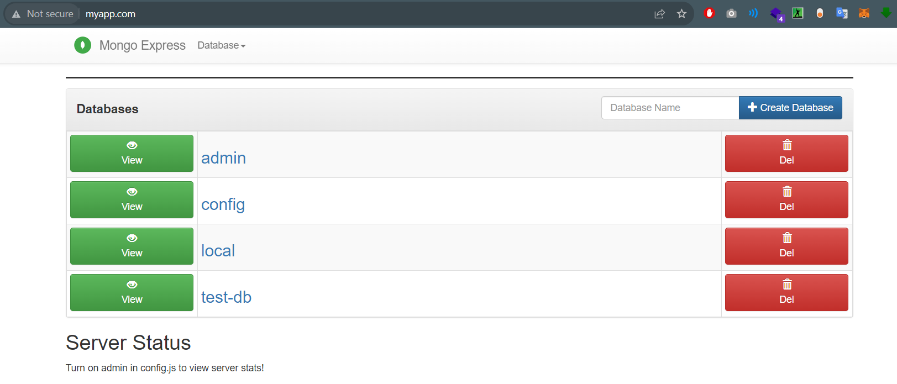
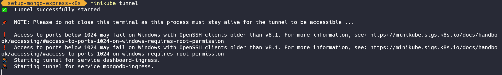

# Kubernetes Cluster Deployment and Orchestration of MongoDB and Mongo-Express



This repository provides a step-by-step guide to set up MongoDB Express on a Kubernetes cluster using Minikube, along with Ingress for domain-based access. Follow the instructions below to get started.

## Prerequisites

1. [Minikube](https://minikube.sigs.k8s.io/docs/start/) is installed and running.
2. [kubectl](https://kubernetes.io/docs/tasks/tools/install-kubectl/) is installed and configured to work with Minikube.


## Step 1: Clone the Repository

```bash
git clone https://github.com/ZebbaraAbdessamad/setup-mongo-express-kubernetes.git
cd setup-mongo-express-K8s

```
## Step 2: Apply Namespace

Apply the MongoDB and MongoDB Express namespace:

```bash
kubectl apply -f mongo-namespace.yaml

```
## Step 3: Apply Secret

Apply the MongoDB secret for authentication:

```bash
kubectl apply -f mongo-secret.yaml

```

## Step 4: Deploy MongoDB

Apply the MongoDB deployment and configuration:

```bash
kubectl apply -f mongo-deployment.yaml
kubectl apply -f mongo-configMap.yaml

```

## Step 5: Deploy MongoDB Express

Apply the MongoDB Express deployment:

```bash
kubectl apply -f mongo-express-deployment.yaml

```

## Step 6: Set Up Ingress

Ensure you have an Ingress controller running on your Minikube cluster. If not, you can deploy one like [NGINX-Ingress-Controller](https://kubernetes.github.io/ingress-nginx/deploy/).

Apply the Ingress configuration:

```bash
kubectl apply -f mongo-ingress.yaml

```

## Step 7: Configure Domain Name

Add the following entry to your hosts file (e.g., /etc/hosts or C:\Windows\System32\drivers\etc\hosts):

```bash
127.0.0.1  myapp.com

```

## Step 8: Start Minikube Tunnel




To access the MongoDB Express application through the domain name myapp.com, start a Minikube tunnel:

```bash
minikube tunnel

```

## Step 9: Access MongoDB Express

Open your web browser and navigate to http://myapp.com to access the MongoDB Express dashboard.


## Clean Up

To remove the deployed resources, run the following commands:

```bash
kubectl delete -f mongo-ingress.yaml
kubectl delete -f mongo-express-deployment.yaml
kubectl delete -f mongo-configMap.yaml
kubectl delete -f mongo-deployment.yaml
kubectl delete -f mongo-secret.yaml
kubectl delete -f mongo-namespace.yaml

```

## Conclusion

Congratulations! You've successfully set up MongoDB Express on Kubernetes using Minikube and configured Ingress for domain-based access. You can now manage your MongoDB databases through the user-friendly MongoDB Express interface.

## License

The code and documentation in this repository are provided under the following license:

[MIT License](https://opensource.org/licenses/MIT)

© 2023 Zebbara Abdessamad

